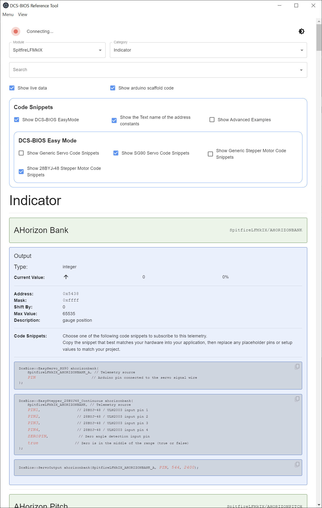

## Bort-EasyMode

Bort-EasyMode (Bios Reference Tool) is a standalone Electron app for browsing
DCS-BIOS data and generating Easy Mode-oriented snippets and reference output.

It began as a fork of the original Bort project and has been adapted into its
own Easy Mode-focused distribution for use with the DCS-BIOS Easy Mode Arduino
library.

## Why?

The original Bort helped modernize the old Chrome-app-based BIOS reference
workflow. 

Bort-EasyMode builds on that idea, but focuses on the Easy Mode
library workflow, beginner-friendly copy/paste output, and Easy Mode-specific
snippet generation.

## Installation

Download and run the setup for the [latest
release](https://github.com/wotupfoo/Bort-EasyMode/releases/latest) for your
operating system.

## Usage

When you first run the app, point it at the folder containing the DCS-BIOS JSON
documentation files. Use `Menu -> Select dcs-bios location` or press `Ctrl+O`,
then select a folder such as:

`%USERPROFILE%/Saved Games/DCS.openbeta/Scripts/DCS-BIOS/doc/json`

Once that path is set, the app will remember it.

## Relationship To Easy Mode

Bort-EasyMode is the companion reference and snippet-generation tool for the
DCS-BIOS Easy Mode Arduino library. It is intended to work alongside:

- `DCS-BIOS`
- `DCS-BIOS-Easy-Mode`

## Contributing

Pull requests are welcome.
