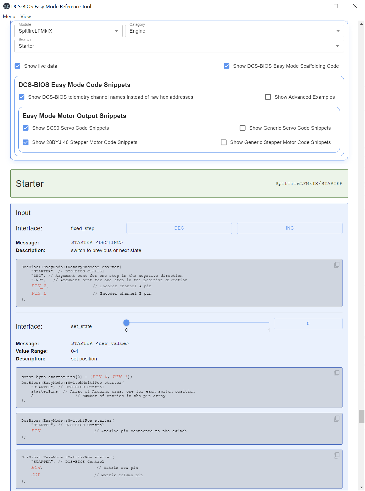

## Bort - The DCS-BIOS Easy Mode Reference Tool

Bort-EasyMode (BiOs Reference Tool) is a standalone Windows app for browsing
DCS airplane data and generating Easy Mode-oriented snippets and reference output.
The snippets of code are used with the [DCS-BIOS Easy Mode Arduino Library](https://github.com/wotupfoo/dcs-bios-arduino-easymode/releases) to create sim-pit panels.

If you just want to install Bort-EasyMode, go to the
[Releases page](https://github.com/wotupfoo/Bort-EasyMode/releases/latest).
Most users do not need the source code view on GitHub.

It began as a fork of the original BORT project and has been adapted into its
own Easy Mode-focused distribution for use with the DCS-BIOS Easy Mode Arduino
library.

## Why?

The original BORT updated the old DCS BIOS reference workflow. However it expects a pretty high 
level of programming skill. The layout of the app, the instructions and the example code are not 
non-programmer friendly. Also, it doesn't support Stepper motors which are needed for a lot of gauge types that move more than 360 degrees or need to move faster than Servos can do.

Bort-EasyMode builds on that platform, but focuses on the Easy Mode library workflow, beginner-friendly copy/paste output, and Easy Mode-specific snippet generation.

## Installation

If you want to install the app, use the
[latest release](https://github.com/wotupfoo/Bort-EasyMode/releases/latest).

Do not use the green `Code` button unless you want the source code.

Download and run the setup from the latest release for your operating system.

## Usage

Before you use Bort, you need to have DCS installed.

You also need to have the version of [DCS-BIOS from Skunkworks](https://github.com/DCS-Skunkworks/dcs-bios/releases/tag/v0.11.3) installed. Skunkworks is a community driven version of
the original DCS-BIOS that took over when the original lost momentum. It continues to get updates to this day.

You also need the DCS-BIOS Easy Mode installed. Follow the instructions here:

[DCS-BIOS Easy Mode Example (and Install) Guide](https://github.com/wotupfoo/dcs-bios-arduino-easymode/blob/main/documentation/Example_Guide.md)

Then you need to run DCS **and** start DCS-BIOS (The DCS World plugin, not the Arduino toolkit). On first launch, DCS-BIOS will query DCS for all the information about all the planes. This will make a directory of information files (in the **JSON** format). One for each plane.

You can now start BORT. When you first run it you'll need to point to that directory DCS-BIOS filled 
with plane information. Use `Menu -> Select dcs-bios location` or press `Ctrl+O`,
then select a folder such as:

`%USERPROFILE%/Saved Games/DCS.openbeta/Scripts/DCS-BIOS/doc/json` (default location)

Once that path is set, BORT will remember it.

## Relationship To Easy Mode

Bort-EasyMode is the companion reference and snippet-generation tool for the
DCS-BIOS Easy Mode Arduino library. It is intended to work alongside 
[DCS-BIOS-Easy-Mode](https://github.com/wotupfoo/dcs-bios-arduino-easymode/releases), the 
embedded software library added to the Arduino IDE to develop sim-pit panels, switches and more.

## Contributing

Pull requests are welcome.
